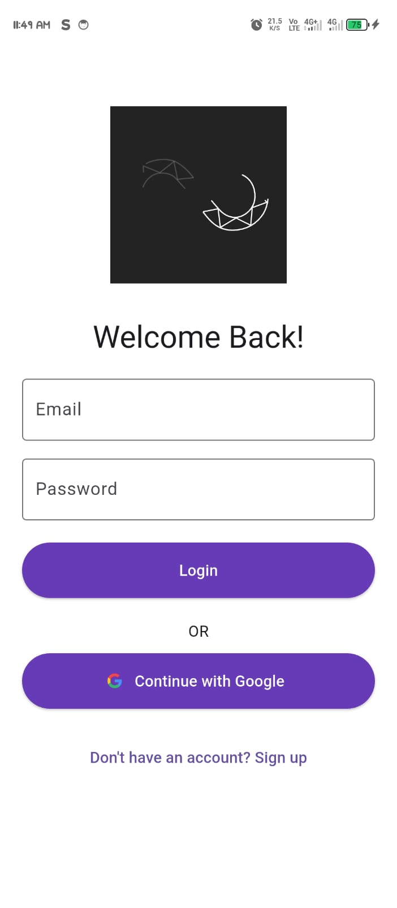
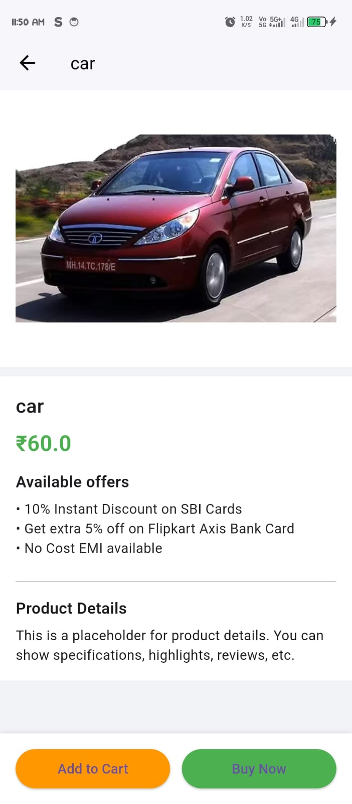
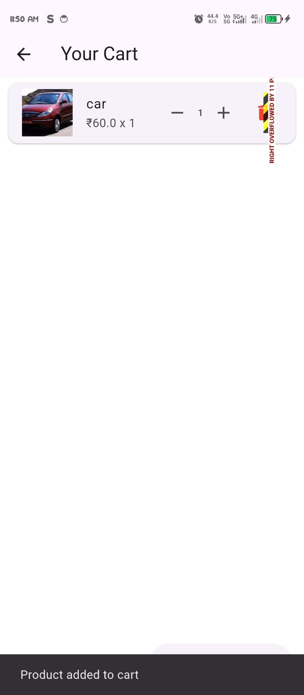
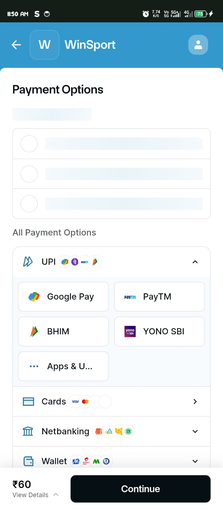

# 🛒 WinSport - Razorpay Payment Integration

This Flutter project demonstrates **UPI app link-based payments** using **Razorpay**. The app allows users to initiate payments directly via the Razorpay interface and handles success/failure callbacks seamlessly.

---

## 🚀 Features

- ✅ Razorpay payment via App Link  
- 🔐 Secure UPI redirection  
- 📲 Mobile-optimized experience  
- 📷 Screenshot documentation  
- 🧾 Transaction success and error handling  

---

## 📸 Screenshots

| Login Screen | Dashboard | Product Detail |
|--------------|-----------|----------------|
|  |  |  |

| Cart Screen | Payment |
|-------------|---------|
|  |  |

---

## 💳 How Payments Work

1. User taps **"Pay with Razorpay"**  
2. App opens the Razorpay UPI app or fallback browser-based payment  
3. On success/failure, the user is redirected back  
4. The result is shown in-app  

---

## 🧩 Dependencies

```yaml
dependencies:
  flutter:
    sdk: flutter
  razorpay_flutter: ^1.3.5
  url_launcher: ^6.1.10
